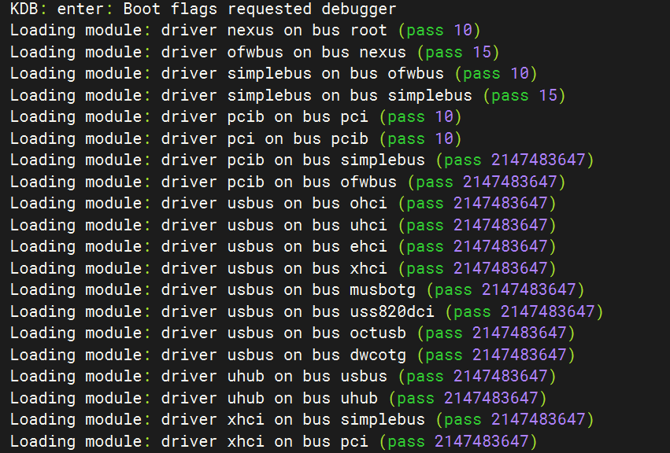
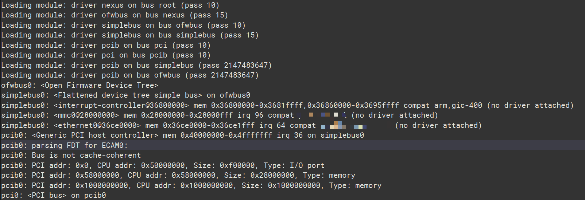
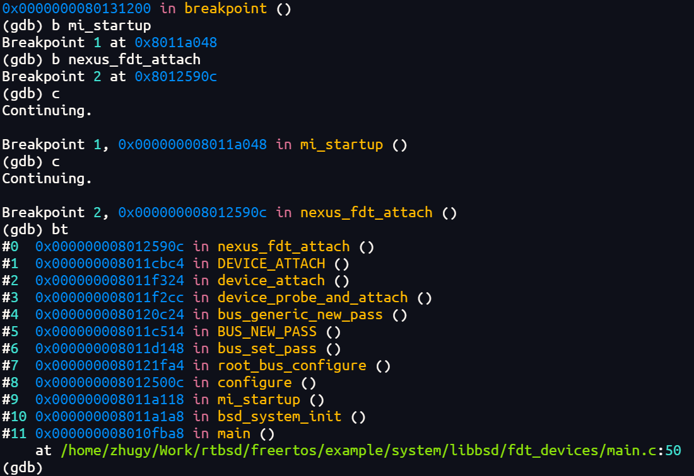
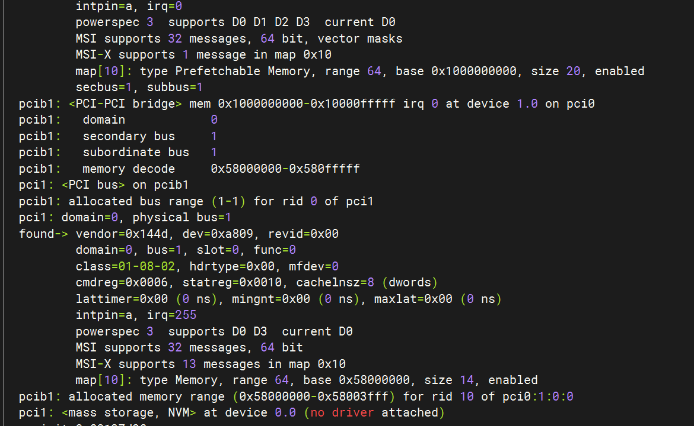
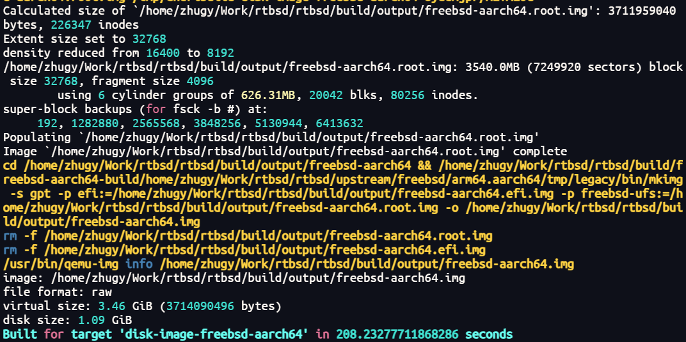
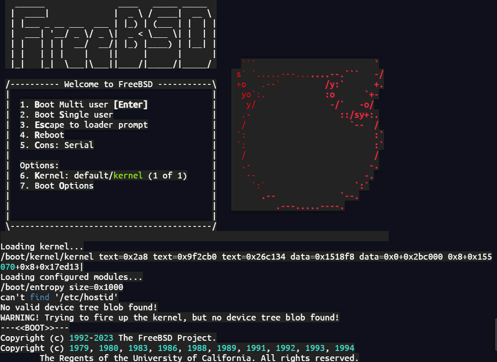
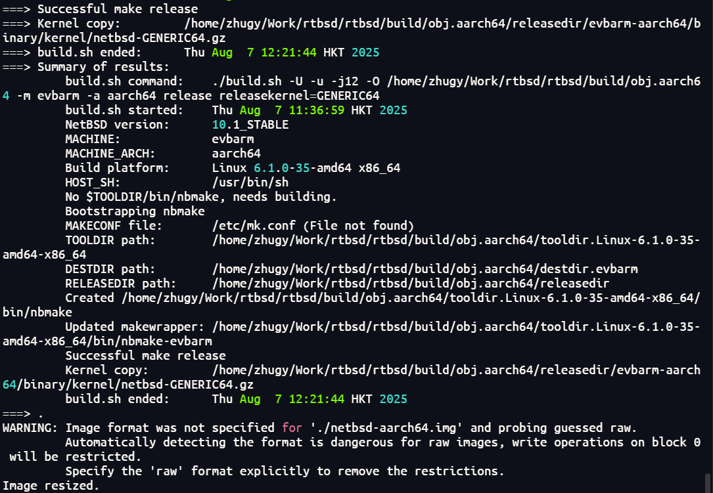
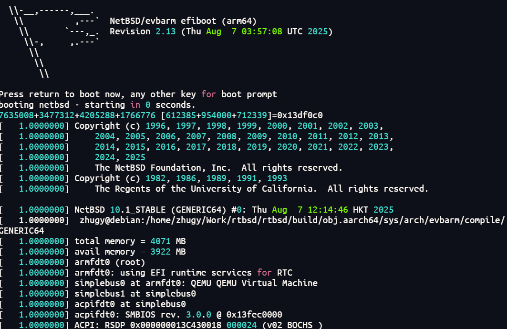

# RTBSD

[中文](./README_zh.md)

> RTBSD, an embedded system development solution that combines RTOS and BSD

RTBSD (RTOS + BSD) is an environment specifically designed for embedded system development. It integrates an RTOS kernel with BSD driver components. This environment is mainly targeted at microprocessor unit (MPU) systems equipped with a memory management unit (MMU), covering architectures such as ARM64, x86, and RISCV64. These systems can obtain excellent driver support under general-purpose operating systems like FreeBSD and Linux, especially for complex buses such as USB and PCIe. However, real-time operating systems (RTOS) often lack support for these complex bus drivers. With RTBSD, developers can seamlessly integrate mature driver components from UNIX-like general-purpose systems such as FreeBSD, NetBSD, and OpenBSD into the RTOS kernel, significantly enhancing the driver capabilities of the real-time operating system.

Currently, RTBSD is still in the early stage of development. The main features that have been implemented are as follows:

- 1. SYSINIT mechanism transplantation: Ported from FreeBSD 14.3, it provides an effective mechanism for system initialization.
- 2. Device tree parsing and driver matching initialization: Also from FreeBSD 14.3, it supports the parsing of the device tree and realizes the automatic matching and initialization of devices and drivers.
- 3. ACPI table parsing and driver matching initialization: Ported from FreeBSD 14.3, it can parse the ACPI table and complete the automatic matching and initialization of devices and drivers.
- 4. ACPI CPPC CPU frequency adjustment: Ported from the implementation of NetBSD 10.1, it realizes the CPU frequency adjustment function in the ACPI CPPC mode.
- 5. ACPI CPU temperature acquisition: From NetBSD 10.1, it can obtain the CPU temperature information in the ACPI mode.
- 6. GDB Stub: From FreeBSD 14.3, which support remote GDB debug with serial

The subsequent development of RTBSD will focus on further expanding driver support. The specific plans include:

- 1. USB protocol stack transplantation: Port the USB protocol stack from FreeBSD 14.3 to support EHCI and XHCI.
- 2. PCIe protocol stack transplantation: Port the PCIe protocol stack of FreeBSD 14.3 to support NVMe devices.
- 3. Adaptation to more real-time operating systems: Such as FreeRTOS, ThreadX, and Nuttx
...

This repository currently supports use in the Debian 12 AMD64 environment and integrates the following functions:

- 1. Building of FreeBSD AARCH64 image and running through QEMU.
- 2. Building of NetBSD AARCH64 image and running through QEMU.
- 3. Building LibBSD as well ad in RT-Thread and running through QEMU.

```
git clone git@github.com:RTBSD/RTBSD.git --recursive rtbsd
```

or

```
git clone https://github.com/RTBSD/RTBSD.git rtbsd
cd rtbsd
./setup.sh
```

- The following specifically describes the above functions.

## 1. Building and run LibBSD

### 1.1 AARCH64

- Building LibBSD libraries，with flatted device tree bus or ACPI bus

```
make libbsd_fdt_aarch64
```

```
make libbsd_acpi_aarch64
```

- Link LibBSD libraries RTOS and start running, loading a doze of BSD driver modules and apply driver as FDT described
> Tested on Firefly v2 dev board with FreeRTOS





- Remote Debugging with GDB stub from FreeBSD,

```
set remotetimeout 1000
set architecture aarch64
set serial baud 115200
set serial parity n
set can-use-hw-watchpoints 1
set breakpoint auto-hw on
set remote hardware-breakpoint-limit 6
set remote hardware-watchpoint-limit 4
file freertos.elf
target remote /dev/ttyUSB0
```



- With LibBSD, one can detect devices on PCI bus in **RTOS** !!!



## 2. Building FreeBSD

- Install the necessary software packages

```
sudo apt install autoconf automake libtool pkg-config clang bison cmake mercurial ninja-build samba flex texinfo time libglib2.0-dev libpixman-1-dev libarchive-dev libarchive-tools libbz2-dev libattr1-dev libcap-ng-dev libexpat1-dev libgmp-dev bc
sudo apt install qemu-system-arm
sudo apt-get install qemu-efi-aarch64
```

- Download the LLVM compilation chain

```
make llvm_x86_64_debian_toolchain
```

### 2.1 AARCH64

- Build the FreeBSD image

```
make freebsd_aarch64_image
```



- Running FreeBSD by QEMU

```
make freebsd_aarch64_run
```



## 3. Building NETBSD

### 3.1 AARCH64

- Build the NetBSD image

```
make netbsd_aarch64_image
```



- Running NetBSD by QEMU

```
make netbsd_aarch64_run
```




## 4. Design

Several design concepts of RTBSD include:

- 1. No user space division: Since most real-time operating systems do not strictly distinguish between kernel space and user space, all code in RTBSD runs in the kernel space, simplifying the system architecture.
- 2. Dependence on the C standard library: Since the namespace of the BSD kernel is very similar to that of C libraries such as Newlibc, RTBSD uses the header files of the C standard library to solve the problem of namespace missing in some transplantation processes.
- 3. Compatibility with multiple BSDs: Taking FreeBSD as the main transplantation object, the driver bus foundation and SYSINIT mechanism of FreeBSD are fully transplanted. The automatic configuration of FreeBSD drivers can be realized through autoconf, while the drivers of NetBSD and OpenBSD need to be manually managed.

The usage method of RTBSD:

RTBSD is not a ready-to-use solution. More precisely, it is a set of tools for transplanting drivers and components from BSD systems, aiming to make the transplantation process more efficient and smooth. Generally speaking, the transplantation process needs to go through the following steps:

- 1. Function verification: Implement and verify the target function to be transplanted on the hardware using the BSD system. If there are problems, feedback and fix them to the upstream.
- 2. Code copying: Keep the original directory structure and copy the code to the corresponding directory of libBSD.
- 3. Header file shielding and reference: Shield the header files in the original BSD code. According to actual needs, meet the compilation requirements by referencing the header files in bsd_compat.h.
- 4. Method stubbing and annotation: For the methods not implemented in LibBSD, perform stubbing processing in bsd_stub.h; for the parts not suitable for compilation and use, use macros for annotation.
- 5. Compilation script configuration: Add the source file and header file directories to the compilation script respectively.
Function verification: In the same hardware environment, use the combination of LibBSD and RTOS to implement and verify the functions.

Why choose the BSD system:

The choice of the BSD system as the source of drivers and components is mainly based on the following advantages:

- 1. Loose license: The BSD system components use a loose license, allowing developers to modify and distribute the code according to their own needs, providing great freedom for developers.
- 2. Excellent implementation and documentation: The BSD drivers and components have excellent implementation quality and are accompanied by complete documentation, which makes the code easy to understand and transplant.
- 3. Complete system architecture: The BSD system has a complete kernel and user mode, and all the required code is included, providing rich resources for transplantation.

The emergence of RTBSD was inspired by [RTEMS-LibBSD](https://github.com/RTEMS/rtems-libbsd) (porting the entire FreeBSD driver components to the RTOS). Unfortunately, RTEMS-LibBSD only supports use in RTEMS. Therefore, RTBSD was redesigned with reference to RTEMS-LibBSD, enabling it to support more RTOSes.

Another key factor for the formation of RTBSD is the [cheribuild](https://github.com/CTSRD-CHERI/cheribuild) project. This project provides a method for cross - building FreeBSD on Linux distributions (mainly Debian and Ubuntu), which is a key prerequisite for the formation of RTBSD (after all, it is impossible to persuade everyone to install a FreeBSD).

## 5. Reference links

- [FreeBSD and RTEMS, Unix in a Real-Time Operating System](https://freebsdfoundation.org/wp-content/uploads/2016/08/FreeBSD-and-RTEMS-Unix-in-a-Real-Time-Operating-System.pdf)
- [RTEMS-LibBSD](https://github.com/RTEMS/rtems-libbsd)
- [cheribuild](https://github.com/CTSRD-CHERI/cheribuild)