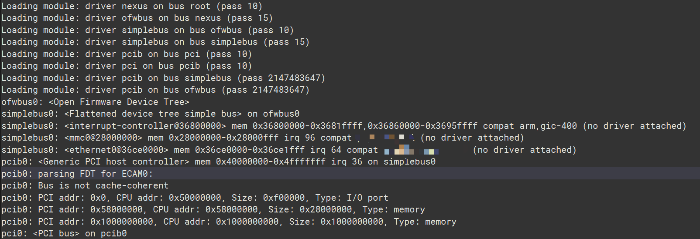
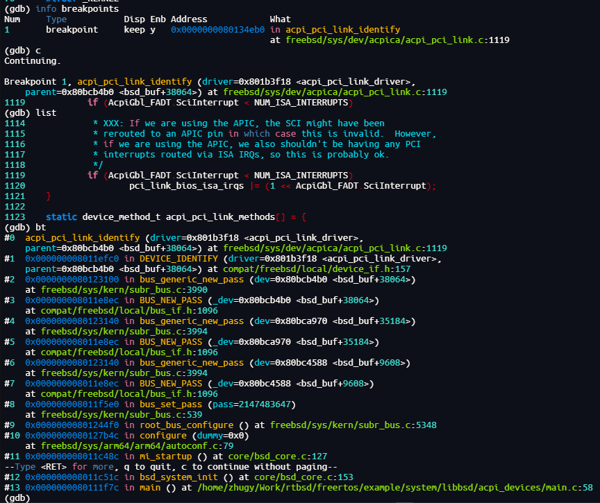

# RTBSD

[English](./README.md)

> RTBSD, 融合 RTOS 与 BSD 的嵌入式系统开发方案

RTBSD（RTOS + BSD）是一款专为嵌入式系统开发量身打造的环境，它将 RTOS 内核与 BSD 驱动组件相结合。该环境主要面向配备内存管理单元（MMU）的微处理器单元（MPU）系统，涵盖 ARM64、x86 和 RISCV64 等架构。这些系统在 FreeBSD、Linux 等通用操作系统下能获得出色的驱动支持，尤其是针对 USB、PCIe 等复杂总线的驱动。然而，实时操作系统（RTOS）在这些复杂总线驱动方面的支持往往较为匮乏。借助 RTBSD，开发者能够将 FreeBSD、NetBSD、OpenBSD 等类 UNIX 通用系统中成熟的驱动组件无缝整合到 RTOS 内核里，显著增强实时操作系统的驱动能力

目前，RTBSD 尚处于开发早期阶段，已实现的主要特性如下：

- 1. SYSINIT 机制移植：从 FreeBSD 14.3 移植而来，为系统初始化提供了有效的机制。
- 2. 设备树解析及驱动匹配初始化：同样源自 FreeBSD 14.3，支持设备树的解析，实现设备与驱动的自动匹配和初始化。
- 3. ACPI 表解析及驱动匹配初始化：移植自 FreeBSD 14.3，可对 ACPI 表进行解析，并完成设备和驱动的自动匹配与初始化。
- 4. ACPI CPPC CPU 调频：移植自 NetBSD 10.1 的实现，实现 ACPI CPPC 模式下的 CPU 调频功能。
- 5. ACPI CPU 温度获取：来自 NetBSD 10.1，能够获取 ACPI 模式下的 CPU 温度信息。
- 6. GDB Stub 机制移植：从 FreeBSD 14.3 移植而来，支持驱动和框架的调试

RTBSD 的后续开发将聚焦于进一步扩展驱动支持，具体计划包括：

- 1. USB 协议栈移植：从 FreeBSD 14.3 移植 USB 协议栈，实现对 EHCI 和 XHCI 的支持。
- 2. PCIe 协议栈移植：移植 FreeBSD 14.3 的 PCIe 协议栈，支持 NVMe 设备。
- 3. 适配更多实时操作系统：比如 FreeRTOS、ThreadX 和 Nuttx
...

本仓库目前支持在 Debian 12 AMD64 环境下使用，集成了下面几个方面的功能
- 1. 完整构建 FreeBSD AARCH64 的镜像，通过 QEMU 进行启动
- 2. 完整构建 NetBSD AARCH64 的镜像，通过 QEMU 进行启动
- 3. 构建 LibBSD 在 FreeRTOS 中使用，在开发板上进行启动

```
git clone git@github.com:RTBSD/RTBSD.git --recursive rtbsd
```

或者

```
git clone https://github.com/RTBSD/RTBSD.git rtbsd
cd rtbsd
./setup.sh
```

- 下面具体说明下以上功能，

## 1. 编译 LibBSD

### 1.1 AARCH64

- 构建 LibBSD 静态库，分别使用设备树总线和 ACPI 总线

```
make libbsd_fdt_aarch64
```

```
make libbsd_acpi_aarch64
```

- 链接 LibBSD 静态库到 RTOS 运行，可以看到启动后加载了一系列 BSD 驱动模块，并且和设备树中描述的设备匹配后能进行驱动初始化
> 使用 Firefly v2 开发板运行 FreeRTOS




- 使用 GDB Stub 利用串口进行远程调试

```
set remotetimeout 1000
set architecture aarch64
set serial baud 115200
set serial parity n
set can-use-hw-watchpoints 1
set breakpoint auto-hw on
set remote hardware-breakpoint-limit 6
set remote hardware-watchpoint-limit 4
file freertos.elf
target remote /dev/ttyUSB0
```




- 使用 LibBSD, 在 RTOS 上也能发现 PCI 总线上的设备 !!!


## 2. 编译 FreeBSD

- 安装必要的软件包

```
sudo apt install autoconf automake libtool pkg-config clang bison cmake mercurial ninja-build samba flex texinfo time libglib2.0-dev libpixman-1-dev libarchive-dev libarchive-tools libbz2-dev libattr1-dev libcap-ng-dev libexpat1-dev libgmp-dev bc libtinfo5
sudo apt install qemu-system-arm qemu-system-x86 qemu-system-riscv64
sudo apt-get install qemu-efi-aarch64
```

- 下载 LLVM 编译链

```
make llvm_x86_64_debian_toolchain
```

### 2.1 AARCH64

- 构建 FreeBSD 镜像

```
make freebsd_aarch64_image
```


- 使用 QEMU 启动 FreeBSD

```
make freebsd_aarch64_run
```


## 3. 编译 NETBSD

### 3.1 AARCH64

- 构建 NetBSD 镜像

```
make netbsd_aarch64_image
```


- 使用 QEMU 启动 NetBSD

```
make netbsd_aarch64_run
```


## 4. 设计

RTBSD 的几个设计理念包括：

- 1. 无用户空间划分：鉴于大多数实时操作系统不会严格区分内核空间和用户空间，RTBSD 中的所有代码均运行在内核空间，简化了系统架构。
- 2. 依赖 C 标准库：由于 BSD 内核命名空间与 Newlibc 等 C 库的命名空间极为相似，RTBSD 借助 C 标准库的头文件来解决部分移植过程中命名空间缺失的问题。
- 3. 兼容多种 BSD：以 FreeBSD 为主要移植对象，全面移植 FreeBSD 的驱动总线基础和 SYSINIT 机制。通过 autoconf 可实现 FreeBSD 驱动的自动配置，而对于 NetBSD 和 OpenBSD 的驱动，则需手动进行管理

RTBSD 的使用方法：

RTBSD 并非一套可直接投入使用的解决方案，更确切地说，它是一套用于从 BSD 系统移植驱动和组件的工具集合，旨在让移植过程更加高效、顺畅。一般而言，移植过程需经历以下步骤：

- 1. 功能验证：在硬件上使用 BSD 系统实现并验证待移植的目标功能。若出现问题，需向上游反馈并修复。
- 2. 代码拷贝：保留原有目录结构，将代码复制到 libBSD 对应的目录下。
- 3. 头文件屏蔽与引用：屏蔽原有 BSD 代码中的头文件，依据实际需求，通过引用 bsd_compat.h 中的头文件来满足编译要求。
- 4. 方法打桩与注释：对于 LibBSD 中未实现的方法，在 bsd_stub.h 中进行打桩处理；对于不适合编译使用的部分，使用宏进行注释。
- 5. 编译脚本配置：将源文件和头文件目录分别添加到编译脚本中。
功能验证：在相同的硬件环境下，使用 LibBSD 与 RTOS 的组合实现进行功能验证。

为什么选择 BSD 系统：

选择 BSD 系统作为驱动和组件的来源主要基于以下几点优势：

- 1. 宽松的许可证：BSD 系统组件采用宽松的许可证，允许开发者根据自身需求对代码进行修改和分发，为开发者提供了极大的自由度。
- 2. 优秀的实现与文档：BSD 驱动和组件具有出色的实现质量，并且配有完善的文档说明，这使得代码易于理解和移植。
- 3. 完整的系统架构：BSD 系统具备完整的内核和用户态，所需的全部代码均包含在内，为移植提供了丰富的资源。

RTBSD 的出现是受到了 [RTEMS-LibBSD](https://github.com/RTEMS/rtems-libbsd) 的启发（将 FreeBSD 驱动组件整体移植到 RTOS 上），但遗憾的是 RTEMS-LibBSD 仅支持在 RTEMS 使用，因此重新参考 RTEMS-LibBSD 重新设计了 RTBSD，使得它可以支持更多 RTOS 使用

RTBSD 能够形成的另一个关键是 [cheribuild](https://github.com/CTSRD-CHERI/cheribuild) 项目，这个项目提供了在 Linux 发行版（主要是 Debian 和 Ubuntu）上交叉构建 FreeBSD 的方法，这是 RTBSD 能够成型的一个关键前提（毕竟我没法说服每一个人都装一台 FreeBSD）

## 5. 参考链接

- [FreeBSD and RTEMS, Unix in a Real-Time Operating System](https://freebsdfoundation.org/wp-content/uploads/2016/08/FreeBSD-and-RTEMS-Unix-in-a-Real-Time-Operating-System.pdf)
- [RTEMS-LibBSD](https://github.com/RTEMS/rtems-libbsd)
- [cheribuild](https://github.com/CTSRD-CHERI/cheribuild)