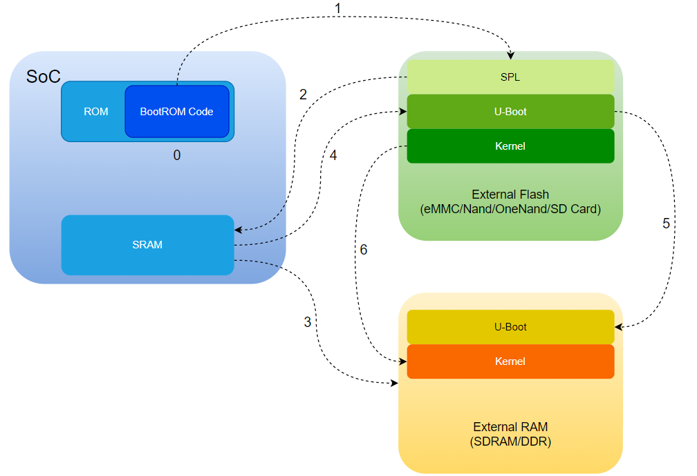

## Soc 启动

- BootROM
- - 通常来说，SoC厂家都会做一个ROM在SoC的内部，这个ROM很小，里面固化了上电启动的代码（一经固化，永不能改，是芯片做的时候，做进去的）；这部分代码呢，我们管它叫做BootROM，也叫作一级启动程序。
- - 芯片上电后先接管系统的是SoC厂家的BootROM，它要做些什么事情呢？初始化系统，CPU的配置，关闭看门狗，初始化时钟，初始化一些外设（比如 USB Controller、MMC Controller，Nand Controller等）
- - BootROM的代码除了去初始化硬件环境以外，还需要去外部存储器上面，将接下来可执行的程序读到内存来执行，直接把外部可执行程序读到DDR显然是不太友好的，一般来说呢，SoC都会做一个内部的小容量的SRAM ，BootROM将外部的可执行程序从外部存储器中读出来，放到SRAM去执行
- - BootROM从具体哪个存储器读出二进制文件呢？SoC厂家一般会支持多种启动方式，比如从eMMC读取，从SDCard读取，从Nand Flash读取等等

- SPL, Secondary Program Loader, 从存储设备中读取trust（如ATF/OP-TEE）和uboot二进制文件，将它们加载到系统内存中并运行它们，进而启动完整的操作系统
- - BootROM会根据Bootstrap Pin去确定从某个存储器来读可执行的二进制文件到SRAM并执行；理论上来说，这个二进制文件就可以是我们的u-boot.bin文件了, 但是这里有一个问题，就是SRAM很贵，一般来说，SoC的片上SRAM都不会太大，一般4KB、8KB、16KB...256KB不等；但是呢，u-boot 编译出来却很大，好几百KB，放不下，因此一般会做一个小的uboot ，这个uboot就叫做SPL（Secondary Program Loader），它很小很小（小于SRAM大小），它先被BootROM加载到SRAM运行
- - SPL要做什么事情呢？最主要的就是要初始化内存控制器，然后将真正的大u-boot从外部存储器读取到SDRAM中，然后跳转到大uboot

- TPL, Targer Program Loader, 芯片级的初始化过程，这个时候的代码都是基于芯片平台的部分，它在启动过程中进行DDR初始化和一些其他的系统配置，以便后续的SPL能够正确地运行

- TPL主要负责初始化系统硬件，而SPL负责加载和运行其它软件组件，如trust和uboot



- RK3399支持从内部BootROM启动，并且支持通过软件编程进行地址重映射。重映射是通过SGRF_PMU_CON0 控制的，当重映射设置为0时，地址0xFFFF0000被映射到BootROM，当重映射设置为1时，0xFFFF0000被映射到片内SRAM
- 在进行重映射前
- - 0x0000 0000 ~ 0xF800 0000：为DDR内存空间；
- - 0xFF8C 0000 ~ 0xFF98 0000：片内SRAM内存空间，一共192KB； 
- - 0xFFFF 0000~ 0xFFFF 8000：为BootROM内存空间，一共32KB；
- 进行了地址重映射后
- - BootROM被映射到地址0xFFFD 0000;
- - 片内SRAM被映射到地址0xFFFF 0000；

- 1. 上电后， A53核心从0xffff0000这个地址读取第一条指令，这个内部BootROM在芯片出货的时候已经由原厂烧写；
- 2. 然后依次从Nor Flash、Nand Flash、eMMC、SD/MMC获取ID BLOCK，ID BLOCK正确则启动，都不正确则从USB端口下载

- RK3399 支持两种引导流程
- 1. 使用Rockchip官方提供的TPL/SPL U-boot（就是我们上面说的小的uboot），该方式完全开源
- 2. 使用Rockchip idbLoader，它由 Rockchip rkbin project 的 Rockchip ddr init bin和miniloader bin组合而成，该方式不开源
> idbloader.img文件是一个Rockchip格式的预加载程序，在SoC启动时工作，它包含 (1) 由Rockchip BootROM知道的IDBlock 头, (2) DDR初始化程序，由BootROM加载到SRAM，运行在SRAM内部, (3) 下一级加载程序，由BootROM加载并运行在DDR上


- u-boot.bin 和 u-boot.img, u-boot.bin是uboot源码编译后生成的原始二进制映像，可以直接烧录到设备的闪存中, u-boot.img则是通过mkimage工具在u-boot.bin基础上增加了一个头部信息，这个头部信息可能也包括一些额外的数据，例如启动参数和内核映像地址等, 通过使用u-boot.img而不是u-boot.bin，可以使引导ROM更容易地识别uboot映像，并更好地指导uboot在设备上正确启动

- u-boot.itb 是 u-boot.img 的另一个变种，也是通过mkimage构建出来的，里面除了u-boot.dtb和u-boot-nodtb.bin这两个uboot源码编译出来的文件之外，还包含了bl31.elf、bl32.bin、tee.bin等ARM trust固件, 其中bl31.elf是必须要有的，bl32.bin、tee.bin是可选的

- trust.img 是 ATF (ARM Trust Firmware)，负责在启动uboot之前把CPU从安全的EL3切换到EL2，然后跳转到uboot，并且在内核启动后负责启动其他的CPU
 

- Rockchip处理器启动可以划分为5个阶段
```
+--------+----------------+----------+-------------+---------+
| Boot   | Terminology #1 | Actual   | Rockchip    | Image   |
| stage  |                | program  |  Image      | Location|
| number |                | name     |   Name      | (sector)|
+--------+----------------+----------+-------------+---------+
| 1      |  Primary       | ROM code | BootROM     |         |
|        |  Program       |          |             |         |
|        |  Loader        |          |             |         |
|        |                |          |             |         |
| 2      |  Secondary     | U-Boot   |idbloader.img| 0x40    | pre-loader
|        |  Program       | TPL/SPL  |             |         |
|        |  Loader (SPL)  |          |             |         |
|        |                |          |             |         |
| 3      |  -             | U-Boot   | u-boot.itb  | 0x4000  | including u-boot and atf
|        |                |          | uboot.img   |         | only used with miniloader
|        |                |          |             |         |
|        |                | ATF/TEE  | trust.img   | 0x6000  | only used with miniloader
|        |                |          |             |         |
| 4      |  -             | kernel   | boot.img    | 0x8000  |
|        |                |          |             |         |
| 5      |  -             | rootfs   | rootfs.img  | 0x40000 |
+--------+----------------+----------+-------------+---------+
```