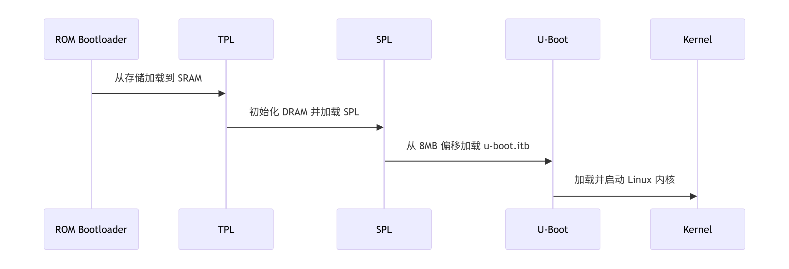

# RK3399 开源启动流程分析



## 启动镜像

```
mmc_idbloader.img - this is the image containing the TPL+SPL of U-Boot compiled for eMMC/SD card install, it should be written to eMMC or SD card at offset 64 sectors.
mmc_u-boot.itb - this is the image containing U-Boot proper compiled for eMMC/SD card install, it should be written to eMMC or SD card at offset 16384 sectors.
```
> 默认偏移量（32KB 和 8MB）

- ROM Code（固化在芯片中）, 自动从存储介质（SD/eMMC）的 32KB 处加载 TPL
- TPL (Trusted Platform Loader)阶段, 负责实现DDR初始化，TPL初始化结束之后会回跳到BootROM程序，BootROM程序继续加载SPL
- SPL (Secondary Program Loader)阶段，复杂加载u-boot.itb文件，然后跳转到uboot执行

### mmc_idbloader.img

- idbloader.img 是由 tpl/u-boot-tpl.bin 和 spl/u-boot-spl.bin 文件使用到 tools 目录下的 mkimage 工具生成

``` makefile
# -n rk3399将镜像文件的名称设置为rk3399
# -T rksd将映像类型指定为Rockchip SD卡启动映像
# -d tpl/u-boot-tpl.bin将生成的TPL镜像文件tpl/u-boot-tpl.bin指定为输入文件，而mmc_idbloader.img 则指定为输出文件
ROCKPRO64_IMG1TYPE=rksd
ROCKPRO64_IMG1NAME=mmc_idbloader.img
./tools/mkimage -n rk3399 -T $(ROCKPRO64_IMG1TYPE) -d tpl/u-boot-tpl.bin:spl/u-boot-spl.bin $(ROCKPRO64_IMG1NAME)
```

### mmc_u-boot.itb

- u-boot.itb实际上是u-boot.img的另一个变种，也是通过mkimage构建出来的，依赖于u-boot.its u-boot.dtb u-boot-nodtb.bin这三个文件

> 由于u-boot官方原本的FIT功能无法满足实际产品需要，所以RK平台对FIT 功能进行了适配和优化，所以自然对mkimage工具的源代码进行了修改、优化；所以对于RK平台硬件，如果使用FIT格式镜像，必须使用RK u-boot源码编译生成的mkimage工具，不可使用u-boot原版的mkimage工具

```makefile
cmd_mkfitimage = $(objtree)/tools/mkimage $(MKIMAGEFLAGS_$(@F)) -f $(U_BOOT_ITS) -p $(CONFIG_FIT_EXTERNAL_OFFSET) $@\
	>$(MKIMAGEOUTPUT) $(if $(KBUILD_VERBOSE:0=), && cat $(MKIMAGEOUTPUT))

u-boot.itb: u-boot-nodtb.bin \
		$(if $(CONFIG_OF_SEPARATE)$(CONFIG_OF_EMBED)$(CONFIG_OF_HOSTFILE),dts/dt.dtb) \
		$(U_BOOT_ITS) FORCE
	$(call if_changed,mkfitimage)
	$(BOARD_SIZE_CHECK)
```

## 启动流程

- ATF 中包含 
1. Boot Loader stage 1 (BL1) AP Trusted ROM
2. Boot Loader stage 2 (BL2) Trusted Boot Firmware
3. Boot Loader stage 3-1 (BL31) EL3 Runtime Firmware
4. Boot Loader stage 3-2 (BL32) Secure-EL1 Payload (optional)
5. Boot Loader stage 3-3 (BL33) Non-trusted Firmware

- BL1: BootROM（芯片固化）, 不可修改
- BL2: 被省略
- BL31: 关键的安全监控层
- BL32: 运行安全操作系统（如 OP-TEE）
- BL33: U-Boot（非安全世界引导）

> 非安全启动下实际的启动流程是

```
BootROM ────> BL31 ────────────> U-Boot(BL33)
(芯片固化)   (安全监控)         (引导加载)
```

### ATF-BL31

- 编译 bl31.elf

```makefile
ROCKPRO64_ATF_PLAT := rk3399
ROCKPRO64_ATF_TARGET := bl31
CFLAGS="-Wno-attributes" make -j$(ROCKPRO64_NPROC) CROSS_COMPILE=$(ROCKPRO64_CROSS_COMPILE) PLAT=$(ROCKPRO64_ATF_PLAT) $(ROCKPRO64_ATF_TARGET)
```

- bl31.elf 链接脚本: bl31.ld.S

- bl31.elf 启动汇编: bl31_entrypoint.S
```
bl31_entrypoint
bl31_setup
bl31_main
el3_exit
```

- bl32.elf C 环境：bl31_main.c
```
bl31_setup
bl31_main
```

- 平台相关的设备初始化，bl31_setup, bl31_plat_arch_setup, bl31_platform_setup
> plat/rockchip/common/bl31_plat_setup.c

- execption handling 初始化，ehf_init，runtime_svc_init

- 下一阶段的启动镜像准备，bl31_prepare_next_image_entry，bl31_plat_get_next_image_ep_info，print_entry_point_info

- 平台运行时准备，bl31_plat_runtime_setup

### UBOOT-TPL

- u-boot-spl和u-boot-tpl使用arch/arm/cpu/armv8/u-boot-spl.lds进行链接

> 使用 scripts/Makefile.spl 编译出 TPL 镜像

```makefile
tpl/u-boot-tpl.bin: tools prepare \
		$(if $(CONFIG_OF_SEPARATE)$(CONFIG_OF_EMBED)$(CONFIG_SPL_OF_PLATDATA),dts/dt.dtb)
	$(Q)$(MAKE) obj=tpl -f $(srctree)/scripts/Makefile.spl all
	$(TPL_SIZE_CHECK)
```

### UBOOT-SPL

```makefile
spl/u-boot-spl: tools prepare \
		$(if $(CONFIG_OF_SEPARATE)$(CONFIG_OF_EMBED)$(CONFIG_SPL_OF_PLATDATA),dts/dt.dtb) \
		$(if $(CONFIG_OF_SEPARATE)$(CONFIG_OF_EMBED)$(CONFIG_TPL_OF_PLATDATA),dts/dt.dtb)
	$(Q)$(MAKE) obj=spl -f $(srctree)/scripts/Makefile.spl all

spl/u-boot-spl.bin: spl/u-boot-spl
	@:
	$(SPL_SIZE_CHECK)
```

### UBOOT

- u-boot使用arch/arm/cpu/armv8/u-boot.lds进行链接

#### PCI 驱动

- 输入 pci enum 开始枚举 pci 总线

```
do_pci
->
pci_init
```